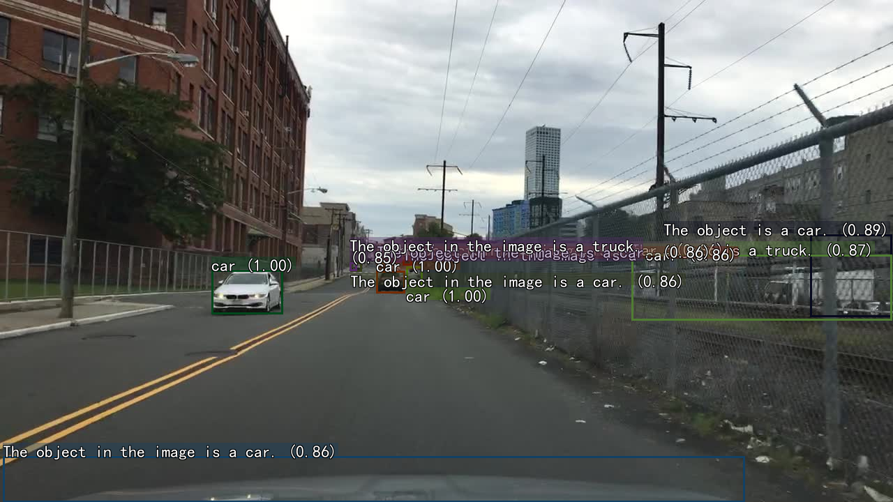
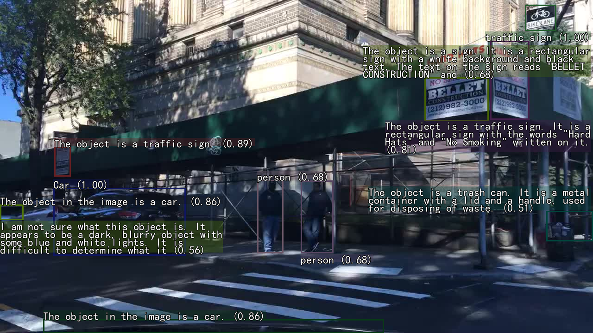
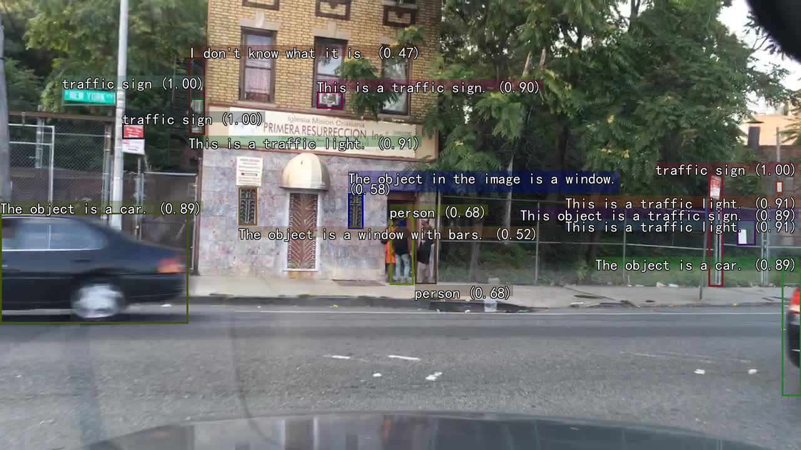
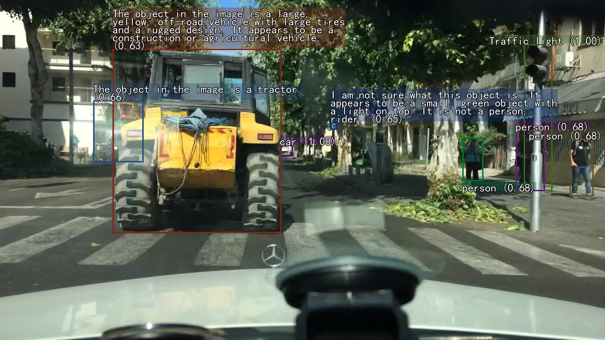
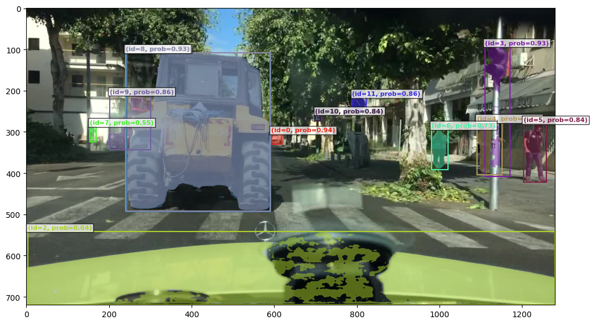
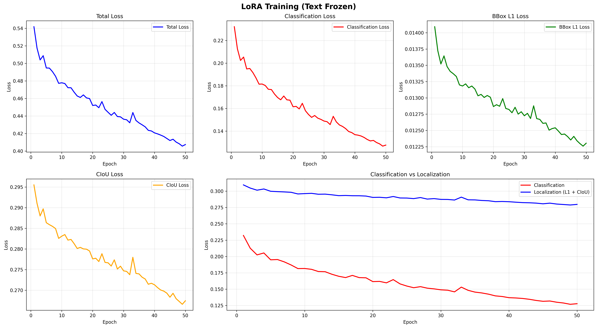
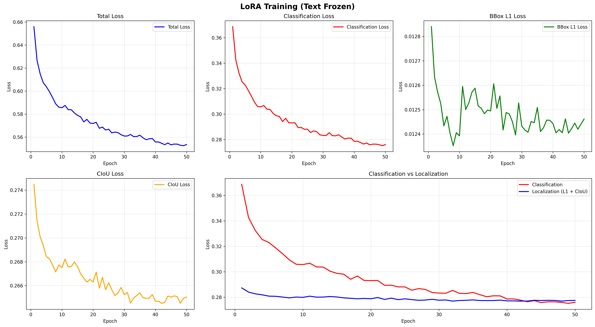
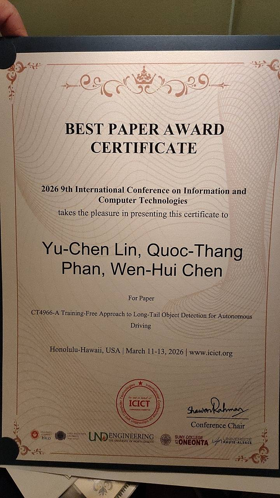

# Materials — Autonomous Driving Perception Research

Research portfolio and supplementary materials for open-vocabulary object detection, VLM-based auto-labeling, and parameter-efficient model adaptation for autonomous driving perception systems.

---

## 📁 Data Engine

System architecture of the auto-labeling data engine.

- [README](Data_engine/README.md)
- [System Overview (PDF)](Data_engine/System_overview.pdf)

---

## 📁 UI — Auto-Labeling Interface

Gradio-based interface for open-vocabulary object detection and object captioning.

- [README](UI/README.md)

---

## 📁 Object Captioning — Qwen2-VL

VLM-based semantic captioning with Qwen2-VL-7B on BDD100K scenes.

- [README](Object_captioning_Qwen2VL/README.md)

---

## 📁 SAM3 — Zero-Shot Segmentation

Bounding box proposals from open-vocabulary detectors refined into pixel-level instance masks using SAM3.

- [README](SAM3/README.md)

---

## 📁 LoRA Vision Adaptation

Parameter-efficient fine-tuning of OWLv2, OmDet-Turbo, and GroundingDINO on BDD100K.

| Model | Baseline | After LoRA | Δ |
|-------|----------|------------|---|
| OWLv2-base-patch16 | 20.63% | **27.81%** | +7.18% |
| OmDet-Turbo-Swin | 17.14% | **21.64%** | +4.50% |
| GroundingDINO-tiny | 20.89% | **23.60%** | +2.71% |

*mAP@300 (IoU 0.50:0.95), evaluated on BDD100K validation set.*

- [README](LoRA-vision-adaptation/README.md)

## Training Curves

**OWLv2** ([google/owlv2-base-patch16-ensemble](https://huggingface.co/google/owlv2-base-patch16-ensemble))

**OmDet-Turbo** ([omlab/omdet-turbo-swin-tiny-hf](https://huggingface.co/omlab/omdet-turbo-swin-tiny-hf))

**Grounding DINO** ([IDEA-Research/grounding-dino-tiny](https://huggingface.co/IDEA-Research/grounding-dino-tiny))

---

## 📁 RAG Tutorial

Multimodal RAG vehicle search using CLIP embeddings, Qwen2-VL captioning, and Qdrant vector store.

- [Notebook](RAG_tutorial/vehicle_search_VLM_tutorial.ipynb)
- [Requirements](RAG_tutorial/requirements.txt)

---

## 📁 Awards & Certificates

- [README](Awards_and_certificates/README.md)
- 🏆 [Best Paper Award — ICICT 2026 (PDF)](Awards_and_certificates/ICICT_26_BestPaperAward_r.pdf)
- [Paper — ICICT 2026 (PDF)](Awards_and_certificates/icict2026-48.pdf)
- [KIT Bio Tech & IT Spring School Certificate](Awards_and_certificates/Certificate_KIT_BioTech_IT_Spring_School%20.pdf)
- [KIT Global Human Resource Development Certificate](Awards_and_certificates/KIT_Certificate%20of%20Completion_PHAN%20QUOC%20THANG.pdf)
- [Yanmar Agri R&D Internship Certificate](Awards_and_certificates/Certificate-Yanmar.pdf)
- [IELTS Certificate](Awards_and_certificates/IELTS-Thang0001.pdf)

---

## License

[MIT](LICENSE)
